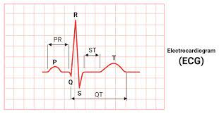

# Visualize ECG with LightingChart
## Introduction
**Electrocardiogram analysis** (ECG analysis) is a process of recording, processing and analyzing a patient’s heart’s electrical activity. 
This activity is recorded from a patient using electrodes placed on the skin.\
Though, it is important to note, that ***ECG doesn’t equal heartrate*** as by analyzing ECG data it is possible to get a comprehensive picture of heart’s activity. 
This includes timing, strength of the heart beats and it can reveal not only heart rate, but also rhythm and presence of arrhythmias, heart attacks and other diseases.



Processing ECG data is a complex thing. It consists of recording signal, its filtering, digitalization and actions related to analyzing. 
They include calculation of the heart rate, diagnosing the rhythm, and generating a report.

The importance of monitoring and analyzing heart data is huge, as by seeing detailed condition of the heart it is possible to prevent lethal diseases, or if diseases occurred, take the right steps to treat them. These diseases include arrhythmias (tachycardia, bradycardia), myocardial ischemia, cardiomyopathy, pericarditis and Wolff-Parkinson-White syndrome.
## LightningChart Python
For this task we may use [LightningChart](https://lightningchart.com/python-charts/) library. It provides a wide range of tools for creating graphs that can be useful for ECG signal processing in Python. \
In this project, we will mainly use:
- XY charts ([Link to docs](https://lightningchart.com/python-charts/docs/charts/chart-xy/)) 
- Dashboard functionality ([Link to docs](https://lightningchart.com/python-charts/docs/guides/grouping-charts/))

LightningChart uses GPUs for faster rendering, so it is possible to 'feed' it a huge sample of data (which will be the case in this project).
## Setting Up Python Environment
For ECG signal processing in Python, first we need to set up our Python environment. 
### Installation of Python on Mac
I recommend using [Homebrew package manager](https://brew.sh/) as it is popular and has a lot of packages.\
Moreover, it is arguably more convenient than installing Python using .dmg.

#### 1. First step is installing Homebrew itself
> You can skip this step if it is already installed on your Mac

Enter Terminal app and copy/paste this string
```sh
/bin/bash -c "$(curl -fsSL https://raw.githubusercontent.com/Homebrew/install/HEAD/install.sh)"
```
:exclamation: **Important note:** 
  Installation of Homebrew can be not fast, usually from 5 to 15 minutes.

#### 2. Installation of Python
```sh
brew install python
```
This command will install the latest stable version of python.


<details>
  <summary><b>If you don't want to use Homebrew</b></summary>
  You can access the <a href = 'https://www.python.org/downloads/macos/'>official Python website</a>, select the      latest stable version downloader for MacOS (it is named macOS 64-bit universal2 installer) and follow the installation instructions.
</details>

You can check the version using `python3 –version` in Terminal.
> If it displays `Unknown command` error, it is most likely due to PATH variables. Refer to  
[this guide](https://www.mygreatlearning.com/blog/add-python-to-path/) to fix.

---
### Installation of Python on Windows
I recommend using cli tool [Winget](https://learn.microsoft.com/en-us/windows/package-manager/winget/). 

#### Install Python package
Open cmd or PowerShell as Administrator and type in:
```powershell
winget install Python.Python.3
```

<details>
  <summary><b>If you don't want to use Winget</b></summary>
  You can access the <a href = 'https://www.python.org/downloads/macos/'>official Python website</a>, select the      latest stable version downloader for Windows <br> (it is named Windows installer (64-bit)) and follow the installation instructions.
</details>

You can verify installation of python and pip by typing `python --version` and `pip --version` respectively. 
> If it displays `'command' is not recognized` error, it is most likely due to PATH variables. Refer to  
[this guide](https://www.mygreatlearning.com/blog/add-python-to-path/) to fix.

---

### Installation of IDE
For IDE (integrated development environment) I recommend using [PyCharm](https://www.jetbrains.com/pycharm/download/?section=mac) as it is clean and powerful. However, full version is paid so you can also use [VSCode](https://code.visualstudio.com/).

(*Optional*) You may want to set up **venv** (Python virtual environment) so you can install packages there and not clutter the Python installation.
Environment creating instructions:
- PyCharm - https://www.jetbrains.com/help/pycharm/creating-virtual-environment.html#python_create_virtual_env
- VSCode - https://code.visualstudio.com/docs/python/environments

Then, using the terminal (IDEs have integrated terminals) install needed packages:
```bash
pip install PyQt5 PyQt5-sip PyQt5-Qt5 PyQtWebEngine pandas lightningchart
```
---
### Libraries Used
#### Pandas
In this project, we will use mainly the dataframe, two-dimensional data structure provided by Pandas. It can be easily created from CSV or Excel file.

#### PyQt
PyQt is a Python library for developing GUI applications. It is the easiest GUI app library to use with LightningChart.

#### LightningChart
Lightningchart is the main library used it the project for ECG signal processing in Python. It provides a highly customizable graph building tools, including simple XY charts, 3D charts, Bar charts, Spider charts, Map charts. However, this time we will use only XY charts and Dashboard component of LightningChart library.

## Loading and Processing Data
You can find a lot of medical data, including ECG data for analyzing in Python, at PhysioNet website (https://physionet.org/content/autonomic-aging-cardiovascular/1.0.0/) \
Here, you can download .hea and .dat pairs.
- .dat files are the data itself
- .hea contains the header for each corresponding .dat file

### After that, it is needed to convert the waveform data into the CSV files. 
It can be done using **wfdb** and **pandas** Python packages.
```python
import wfdb
import pandas as pd

# path to file pair
record_name = 'data/0100'

# read the record
record = wfdb.rdrecord(record_name)

# extract signal data and column names
signal_data = record.p_signal
column_names = record.sig_name

# create a dataframe
df = pd.DataFrame(signal_data, columns=column_names)

# dave df to a CSV file
csv_file_path = 'data/nibp.csv'
df.to_csv(csv_file_path, index=False)

print(f"Data successfully written to {csv_file_path}")
```
> Ready-made CSV files will be attached to the article.

Now we are ready to write an application for ECG processing in python.

## Visualizing data with LightningChart
#### 1. First, we need to import needed packages:
```python
import sys
import threading
import pandas as pd
from PyQt5.QtCore import *
from PyQt5.QtWidgets import *
from PyQt5.QtWebEngineWidgets import *
import lightningchart as lc
```
#### 2. Creating class for PyQt window
```python
window_width = 1600
window_height = 900

class App(QMainWindow):
    def __init__(self, url):
        super(App, self).__init__()  # Call the base class constructor
        self.setWindowTitle("Medical Dashboard")  # Set the window title
        self.setGeometry(100, 100, window_width, window_height)  # Set the window geometry

        self.web_view = QWebEngineView()  # Create a web view widget
        self.setCentralWidget(self.web_view)  # Set the web view as the central widget

        self.web_view.setUrl(QUrl(url))  # Load the medical dashboard URL
```
#### 3. Setups for LightningChart graphs
First, set your license key:
```python
lc.set_license("<your_license_key>")
```
LightningChart provides a wide range of setups.
For using with PyQt, we need to create a `dashboard`. \
:exclamation: **Important:** 
  In this example, we also have blood pressure in our dashboard.
```python
dashboard_columns_amount = 1
dashboard_rows_amount = 2  

if __name__ == "__main__":
    # Initialize dashboard
    dashboard = lc.Dashboard(columns=dashboard_columns_amount, rows=dashboard_rows_amount, theme=lc.Themes.Dark)
    nibp_file_path = 'data/nibp.csv'  # Put CSV data inside   
    ecg_file_path = 'data/ecg.csv'    # 'data' folder
    df_nibp = pd.read_csv(nibp_file_path)  # Read CSV files  to DataFrames using pandas
    df_nibp = df_nibp[0:40000]  # Cut the record to 40 seconds
    df_ecg = pd.read_csv(ecg_file_path)
    df_ecg = df_ecg[0:40000]
    y_ecg = df_ecg['ECG']  # Extract Ys from DataFrame
    y_nibp = df_nibp['NIBP']  
    x = df_ecg['time']  # Extract Xs from DataFrame
    
    # Create arrays from Xs and Ys
    xs = []  
    ys_ecg = []
    ys_nibp = []
    for i in range(len(x)):
        xs.append(x[i])
        ys_ecg.append(y_ecg[i])
        ys_nibp.append(y_nibp[i])
```
When the prerequisites are ready, we can create needed graphs inside our dashboard.
```python
    # Add ChartXY to dashboard
    chart_ecg = dashboard.ChartXY(column_index=0, row_index=0, title='Cardiogram')

    series_ecg = chart_ecg.add_line_series(data_pattern='ProgressiveX')  # This is needed for progressive adding of data, for the graph to be 'dynamic'
    series_ecg.set_line_color(lc.Color(255, 0, 0))  # Set the color for ECG (red)

    x_axis_ecg = chart_ecg.get_default_x_axis()   # Get the axes
    y_axis_ecg = chart_ecg.get_default_y_axis()   # of the chart
    x_axis_ecg.set_scroll_strategy(strategy='progressive')  # Set the x_axis_ecg to progressive scroll strategy
    x_axis_ecg.set_interval(start=-3, end=3, stop_axis_after=False)  #  Set borders for the graph 
    y_axis_ecg.set_default_interval(start=-1.6, end=1)  
    y_axis_ecg.set_title('mV')  # Set titles for axes
    x_axis_ecg.set_title('ms')
```
Then, add another chart to the dashbord the same way:
```python
    chart_nibp = dashboard.ChartXY(column_index=0, row_index=1, title='Blood Pressure')

    series_nibp = chart_nibp.add_line_series(data_pattern='ProgressiveX')
    series_nibp.set_line_color(lc.Color(0, 255, 0))

    x_axis_nibp = chart_nibp.get_default_x_axis()
    y_axis_nibp = chart_nibp.get_default_y_axis()
    x_axis_nibp.set_scroll_strategy(strategy='progressive') 
    x_axis_nibp.set_interval(start=-3, end=3, stop_axis_after=False)
    y_axis_nibp.set_default_interval(start=70, end=130)
    y_axis_nibp.set_title('mmHg')
    x_axis_nibp.set_title('ms')
```
Now to the difficult part. \
In order to emulate the real-time ECG, we need to add data 'gradually' to our chart. \
In this example, we add 10 points to the graph per tick. You can experiment with this number to change the speed of scrolling.
```python
    # Set max sample count. 
    # It is basically the amount of memory used by the chart before dropping older points
    series_ecg.set_max_sample_count(10000)
    series_nibp.set_max_sample_count(10000)
    
    # Function for gradually adding data
    def generate_data():
        for point in range(0, len(x), 10):
            series_ecg.add(xs[point:point + 10], ys_ecg[point:point + 10])
            series_nibp.add(xs[point:point + 10], ys_nibp[point:point + 10])

    # Initialize the real-time dashboard server and get the URL
    url = dashboard.open_live_server()
    # Create a thread which will generate and append data to the dashboard
    thread = threading.Thread(target=generate_data, args=()).start()
    
    # Create PyQt app 
    app = QApplication(sys.argv)
    dashboard_app = App(url)
    dashboard_app.show()
    sys.exit(app.exec())
```
## End result


## Conclusion
In this guide, we created an app for ECG signal processing in Python. We used powerful libraries `lightningchart`, `pandas`, `PyQt`. With the ready graphs, we are now all set to performing ECG analysis on our graphs. It can be used to detect various diseases and also for machine learning.

#### Benefits of using LightningChart
LightningChart provides a lot of ready-made options for creaing graphs. Otherwise, we would have a headache creating proper charts for Python heart rate displaying, whilst LightningChart has powerful tools to create XY chart and make it progressive. 

Moreover, due to GPU usage of LightningChart, the progressive charts look smooth on powerful machines and we can use such big samples of ECG data.

The are lots of other tools in the library, you can review various code snippets for different tasks at [LightningChart Python Guide](https://lightningchart.com/python-charts/docs/).